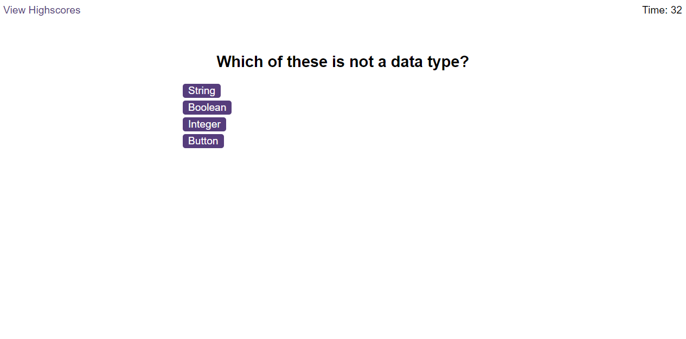

# Code-Quiz

## Description

The purpose of this application is to prompt the user with a series of multiple choice questions on Javascript.
The quiz is timed and a 10 second penalty is given for each incorrect answer.
The quiz ends when the users answers every question or when the timer reaches 0.
The user has the ability to enter their name and view highscores once the quiz is completed.

## Installation

N/A

## Usage

Press the start quiz button to start the quiz.
Click one of the 4 answer buttons for each question.
Once the quiz has ended, enter your name in the prompt and submit your score.
Highscores can be reset by pressing the "Clear Highscores" button.

## Deployed Page

## Credits

George Hornbuckle

## License

Please refer to the license in the repo.